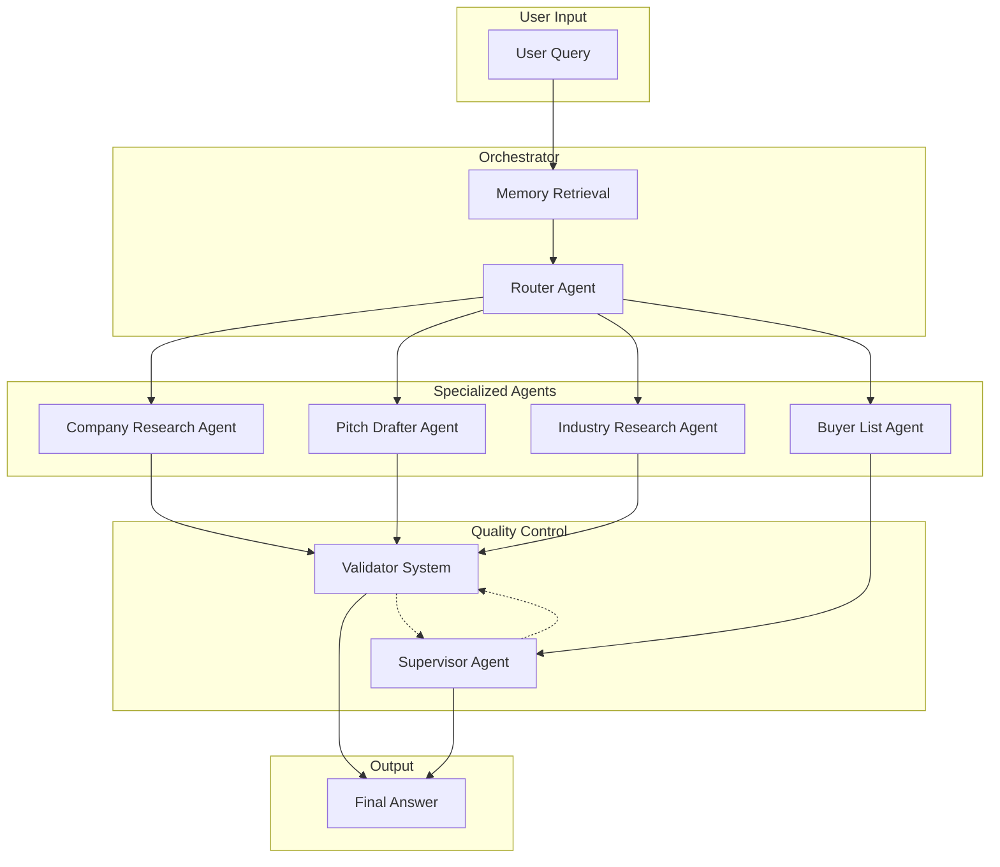

# Agent Orchestration Flow

This document provides an overview of the Brae AI-native M&A advisory platform's agent orchestration architecture and workflow execution patterns.

## System Architecture Overview

Brae is an AI-powered M&A advisory platform that orchestrates multiple specialized agents to provide comprehensive business intelligence, pitch generation, and strategic advisory services. The system uses LangGraph for workflow orchestration and maintains a modular architecture with specialized agents for different business intelligence tasks.

## Core Agent Categories

The platform consists of four primary agent categories, each with specific prompts and execution patterns:

### 1. Company Research Agent

**Purpose:** Conducts deep research and analysis of target companies for M&A advisory

**Execution Flow:**

- **Planner** (Position 1): Generates targeted research queries (max 20) for comprehensive company analysis
- **Research Execution**: Fan-out parallel research using Perplexity Sonar Reasoning Pro
- **Synthesizer** (Position 2): Compiles research findings into structured markdown reports

**Key Capabilities:**

- Multi-query research planning with call budget management
- Parallel research execution with citation tracking
- Structured synthesis with industry analysis integration
- Real-time progress callbacks and error handling

### 2. Pitch Drafter Agent

**Purpose:** Creates compelling pitch decks and strategic presentations for M&A transactions

**Execution Flow:**

- **Market Research** (Position 1): Conducts industry and market analysis
- **Company Research Integration**: Leverages existing company research data
- **Insight Reasoning** (Position 2): Generates strategic insights and investment highlights
- **Slide Finalization**: Creates executive mini-deck outlines with 3-slide structure

**Key Capabilities:**

- Tagged context management for structured data flow
- Investment banking-grade content creation
- Citation mapping and confidence scoring
- Validator integration for quality assurance

### 3. Industry Research Agent

**Purpose:** Provides comprehensive market intelligence and industry analysis

**Execution Flow:**

- **Research Planner** (Position 1): Creates structured research plans with chain-of-thought reasoning
- **Parallel Research Nodes**: Executes 6 specialized research areas simultaneously:
  - Market Overview Analysis
  - Value Chain Assessment
  - Industry Trends Identification
  - Competitive Landscape Mapping
  - Strategic Themes Analysis
  - M&A Activity Review
- **Comprehensive Analysis** (Position 3): Synthesizes findings into strategic insights
- **Final Report** (Position 4): Creates executive-ready industry analysis reports

**Key Capabilities:**

- Multi-node parallel processing architecture
- Chain-of-thought reasoning throughout research process
- Structured industry analysis framework
- Strategic insights generation for business decisions

### 4. Buyer List Agent

**Purpose:** Generates and qualifies buyer lists for sell-side M&A transactions

**Execution Flow:**

- **DEFINE Stage**: Creates initial buyer list (≥50 qualified buyers)
  - Buyer Research Define (Position 1)
  - Company Research Prompt (Position 2)
  - Industry Research Prompt (Position 4)
  - Quality Metrics Define (Position 5)
- **ENRICH Stage**: Enhances buyer profiles with operational intelligence
  - Enrich Buyers Prompt (Position 3)
  - Quality Metrics Enrich (Position 6)
- **Supervisor Coordination**: Manages workflow orchestration and quality control

**Key Capabilities:**

- Multi-stage buyer qualification process
- Quality assessment and refinement loops
- Human-in-the-loop validation
- Structured data enrichment with citations
- Supervisor agent for workflow management

## Agent Orchestration Architecture

The system uses LangGraph for workflow orchestration with the following architectural patterns:

### Execution Patterns

#### Parallel Processing

- **Company Research**: Fan-out parallel research queries (up to 20 concurrent)
- **Industry Research**: 6 parallel research nodes executing simultaneously
- **Buyer List**: Multi-stage sequential processing with parallel enrichment branches

#### Sequential Dependencies

- **Pitch Drafter**: Linear 4-step process with data accumulation
- **Buyer List**: DEFINE → ENRICH → FINALIZE workflow with quality gates

#### Quality Control Integration

- **Validator System**: All agents integrate with quality validation
- **Human-in-the-Loop**: Supervisor agents enable human feedback and refinement
- **Error Recovery**: Comprehensive error handling with fallback mechanisms

### Data Flow Architecture

### Communication Patterns

#### Inter-Agent Communication

- **Tagged Context**: Agents use XML-style tags (`<company_research>`, `<market_research>`) for structured data exchange
- **Citation Management**: Unified citation indexing across all agents
- **State Propagation**: LangGraph state management for data flow between agents

#### External Integrations

- **Perplexity API**: Primary research engine for web search and analysis
- **WebSocket**: Real-time progress updates and streaming responses
- **Database**: Postgres/Redis for conversation persistence and metadata storage
