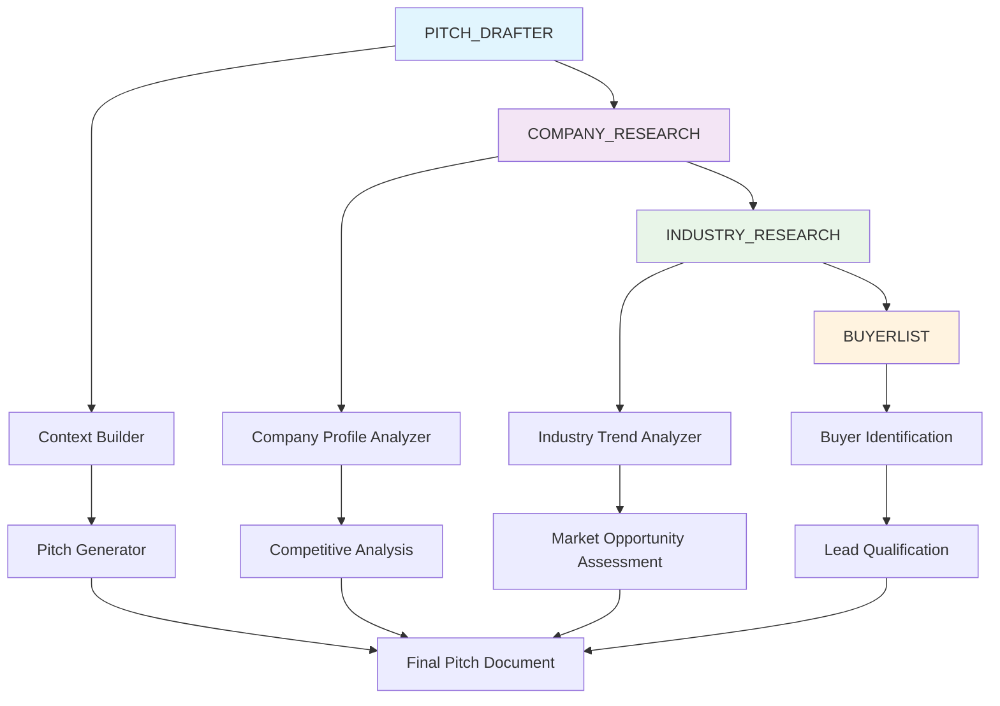
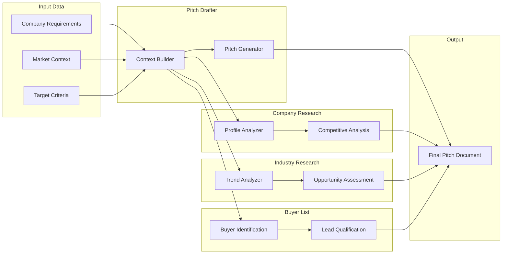

# Agent Orchestration Flow

This document provides an overview of the hierarchical agent execution flow and how prompts are orchestrated to achieve business objectives.

## Overall Flow Architecture

The agent system follows a sequential, hierarchical flow where each agent builds upon the outputs of previous agents to create comprehensive business intelligence and actionable insights.

## Agent Execution Order

### 1. Pitch Drafter Agent

**Purpose:** Establishes the foundation for all subsequent analysis

- **Context Builder** (Position 1): Analyzes input requirements and builds comprehensive context
- **Pitch Generator** (Position 2): Creates compelling pitch content based on context analysis

### 2. Company Research Agent

**Purpose:** Provides deep company intelligence for informed decision-making

- **Company Profile Analyzer** (Position 1): Synthesizes company information from multiple sources
- **Competitive Analysis** (Position 2): Maps competitive landscape and positioning

### 3. Industry Research Agent

**Purpose:** Delivers market intelligence and industry insights

- **Industry Trend Analyzer** (Position 1): Identifies market trends and patterns
- **Market Opportunity Assessment** (Position 2): Evaluates market gaps and opportunities

### 4. Buyer List Agent

**Purpose:** Identifies and qualifies potential buyers

- **Buyer Identification** (Position 1): Discovers potential buyer targets
- **Lead Qualification** (Position 2): Evaluates and scores buyer potential

## Data Flow Dependencies

## Agent Communication Patterns

### Synchronous Execution

- Agents execute in strict sequential order
- Each agent waits for completion of previous agent
- Data flows unidirectionally through the pipeline

### Data Transformation

- Raw inputs → Structured context (Pitch Drafter)
- Context → Company intelligence (Company Research)
- Intelligence → Market insights (Industry Research)
- Insights → Qualified opportunities (Buyer List)

### Error Handling

- Failed agent execution stops the entire flow
- Partial results are preserved for debugging
- Rollback mechanisms available for critical failures

## Performance Characteristics

### Execution Time

- **Pitch Drafter:** 2-5 minutes
- **Company Research:** 10-30 minutes
- **Industry Research:** 15-45 minutes
- **Buyer List:** 5-15 minutes
- **Total Flow:** 30-90 minutes

### Resource Requirements

- **Memory:** 2-4GB per agent
- **CPU:** 2-4 cores recommended
- **Network:** High bandwidth for research operations
- **Storage:** 1-2GB for intermediate results

## Monitoring and Observability

### Key Metrics

- Agent completion rates
- Data quality scores
- Execution time per agent
- Error rates and types
- Resource utilization

### Alert Conditions

- Agent execution > 2x expected time
- Data quality score < 80%
- Error rate > 5%
- Resource utilization > 90%

## Scaling Considerations

### Horizontal Scaling

- Multiple agent instances for parallel processing
- Load balancing across available resources
- Queue management for high-volume scenarios

### Vertical Scaling

- Increased memory for large datasets
- Additional CPU cores for compute-intensive analysis
- Enhanced network capacity for research operations

## Maintenance and Updates

### Prompt Updates

- Regular review of prompt effectiveness
- A/B testing for optimization
- Version control for all prompt changes

### Agent Improvements

- Performance monitoring and optimization
- Accuracy validation against ground truth
- Feature enhancements based on user feedback
